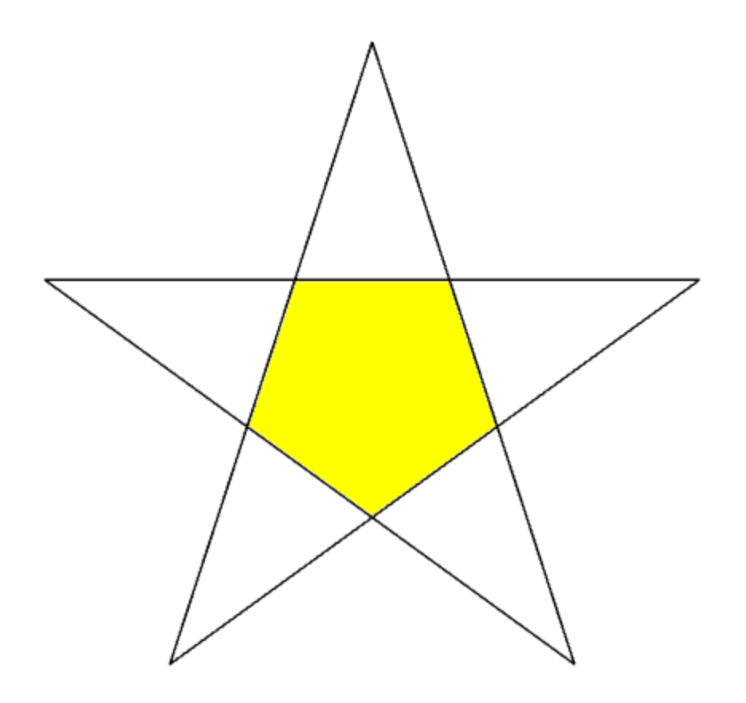
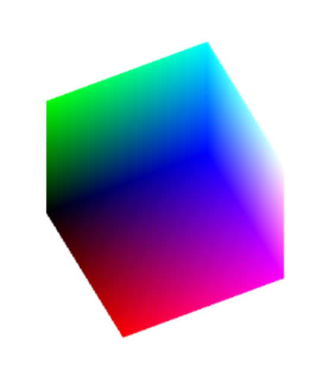
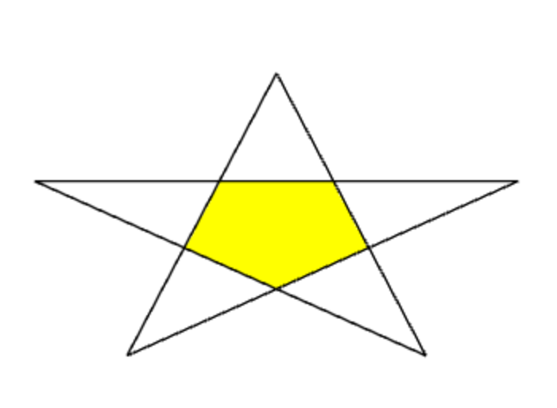
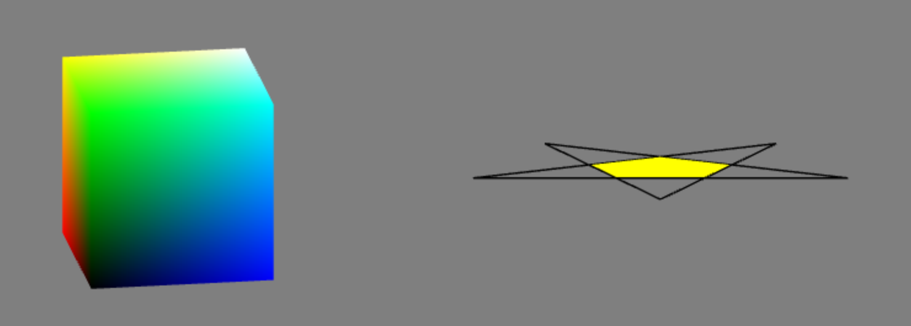
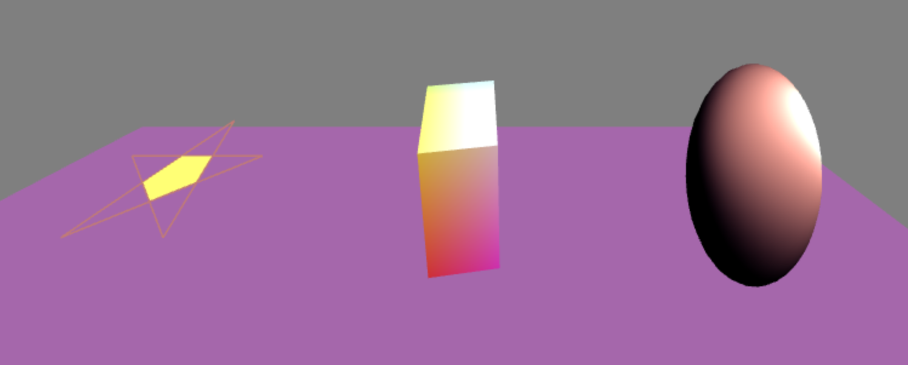
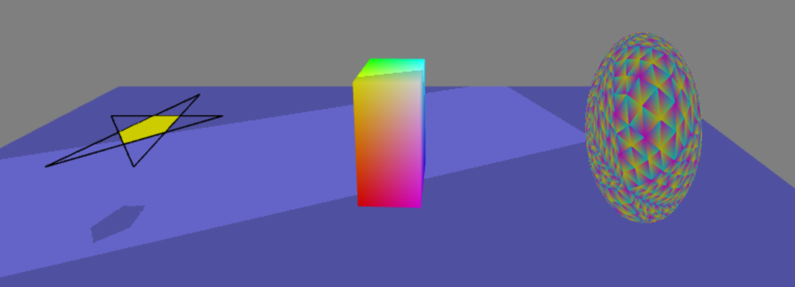
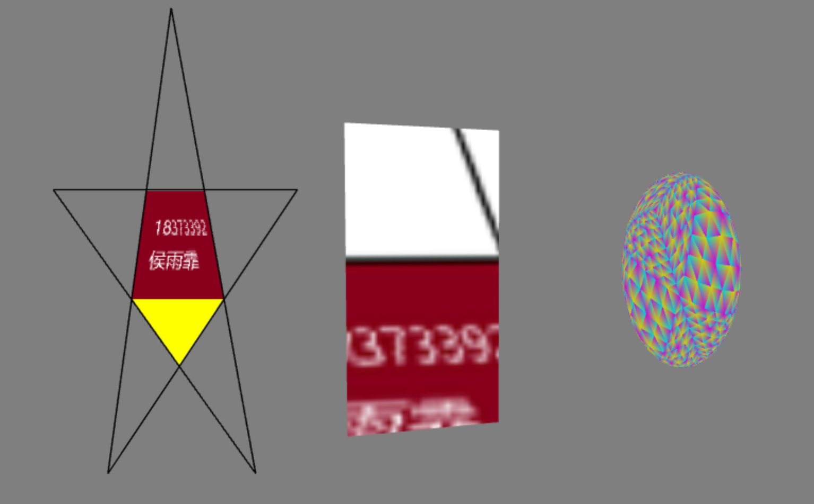

## 计算机图形学编程大作业说明文档

18373392 侯雨霏

完成四个指定任务，[演示视频](video.mp4)。(不过没有上传视频呢，无视它)

演示视频可按住ctrl点击上方链接打开，或者直接打开video.mp4文件。

#### 指定任务一：

**对应文件：**[task1](task1.html) 

**运行方式：**按住ctrl点击上方链接打开，或者直接用浏览器打开task1.html文件。

**简要说明：**建立一对着色器，将五角星分成内部和外框两个部分，按顺序传入需要的顶点位置和颜色，并依次绘制。

**运行截图：**

------

#### 指定任务二：

**对应文件：**[task2-1](task2-1.html), [task2-2](task2-2.html), [task2](task2.html)

task2-1为自动旋转的三维彩色立方体，task2-2为旋转立起来的五角星，task2将两个物体都放上来了。

**运行方式：**按住ctrl点击上方链接打开，或者直接用浏览器打开task2-1.html, task2-2.html, task2.html文件。

**简要说明：**建立一对着色器，因为要动起来，所以定义一个drawScene函数按照很短的间隔刷新，要旋转的物体上使用computeMatrix函数设置位置、旋转等，然后按顺序传入需要的顶点位置和颜色，并依次绘制。

**运行截图：**

------

#### 指定任务三：

**对应文件：**[task3-light](task3-light.html), [task3-shadow](task3-shadow.html)

task3-light为开启光照的结果，task3-shadow为绘制五角星内部阴影的结果。

**运行方式：**按住ctrl点击上方链接打开，或者直接用浏览器打开task3-light.html, task3-shadow.html文件。

task3-light中，可以调整照相机沿x轴运动、光照沿xyz轴运动，以及物体的材质，包括环境光反射系数、漫反射系数、镜面反射系数、高光系数。球体本身颜色为黑色，更方便观察光照效果。

task3-shadow中，可以调整照相机沿x轴运动。球体本身颜色按三角形各个点上色，更方便理解整个球是怎么递归细分绘制的。绘制了五角星内部形状在平面上投射的阴影。

**简要说明：**

task3-light中，建立一对着色器，排列三个物体的位置，使用透视投影矩阵，按顺序传入需要的顶点位置、颜色和法向量，顶点着色器中重定向法向量，片元着色器中计算各个光照分量对颜色的影响，依次绘制。

task3-shadow中，建立两对着色器，把深度纹理附加到帧缓冲上，然后使用该纹理作为原着色器的输入，接下来排列三个物体的位置，使用透视投影矩阵，按顺序传入需要的顶点位置和颜色，并依次绘制。

**运行截图：**

------

#### 指定任务四：

**对应文件：**[task4](task4.html)

**运行方式：**因为使用到了图片文件，所以要用服务器打开task4.html文件，如VSCode的Live Server，否则会产生跨域问题。

可以调整照相机沿x轴运动。

**简要说明：**建立一对着色器，使用2D和Cube两种纹理，在五角星的内部进行纹理贴图，在立方体上进行环境贴图，排列三个物体的位置，按顺序传入需要的顶点位置、颜色、法向量和纹理坐标，并依次绘制。

为方便看效果，五角星和立方体都比之前放大了二倍。

**运行截图：**

